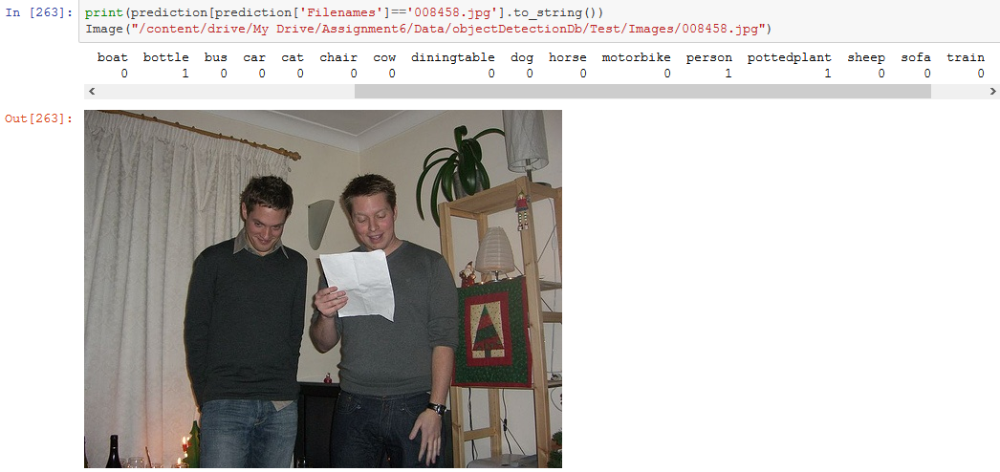
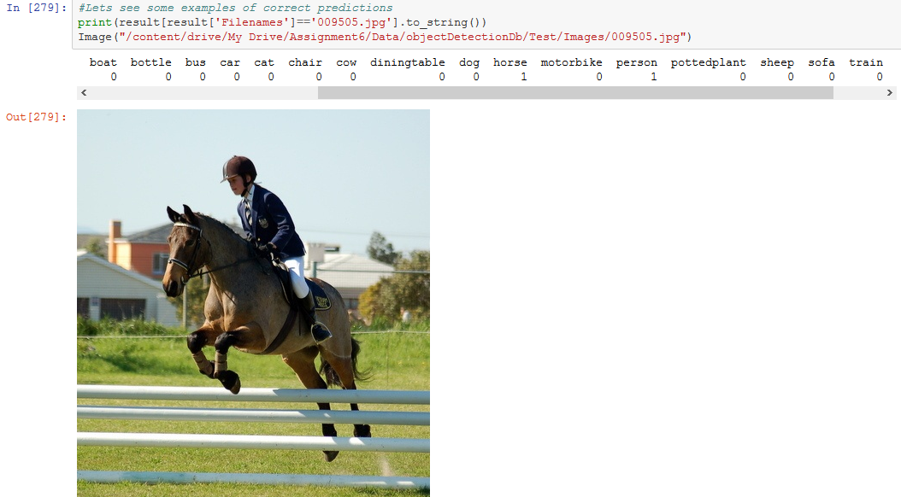

# 🏷️ Multi-Label Image Classification
### PASCAL VOC 2007 Challenge

[](https://www.python.org/downloads/)
[](https://www.tensorflow.org/)
[](https://keras.io/)

> **📖 Detailed Blog Post:** For an in-depth walkthrough with theoretical explanations, code analysis, and architectural insights, check out the comprehensive blog post: [**Multi-Label Image Classification: Three Architectures Compared**](https://analyticalman.com/multi-label-image-classification/)

---

## 🎯 Project Overview

This project tackles the challenging problem of **multi-label image classification** using the PASCAL VOC 2007 dataset. Unlike multi-class classification where each image belongs to exactly one category, here **each image can contain multiple objects** from 20 different classes simultaneously.

**The Challenge:** Predict which objects (out of 20 possible) are present in each image—an image might contain a **person AND a car AND a dog** all at once!

### Sample Outputs

<p align="center">
<!--  -->

</p>

---

## 📊 The Dataset

### PASCAL VOC 2007

The PASCAL Visual Object Classes (VOC) 2007 dataset contains **9,963 images** across **20 object classes**:

| Category | Classes | Count |
|----------|---------|-------|
| **Person** | person | 1 class |
| **Animals** | bird, cat, cow, dog, horse, sheep | 6 classes |
| **Vehicles** | aeroplane, bicycle, boat, bus, car, motorbike, train | 7 classes |
| **Indoor** | bottle, chair, dining table, potted plant, sofa, tv/monitor | 6 classes |

### 📈 Dataset Statistics

```
Training samples: 5,011 unique images
Total annotations: 7,913 (some images have multiple labels)

Class Distribution:
├── Most common: person (2,095 instances - 42% of images)
├── Common: car (761), chair (572), cat (344)
└── Rare: sheep (97), cow (146), boat (188)

⚠️ Class Imbalance: 21:1 ratio between most and least common classes
```

### 📥 Dataset Download

Download from the official PASCAL VOC website:

---

## 🏗️ Three Architectural Approaches

This project explores three distinct neural network architectures, each with different trade-offs:

### Model 1: Twenty Independent Binary Classifiers 🔢

**Concept:** 20 separate CNNs, each trained to detect one specific class.

```python
# Each model has one output neuron with sigmoid activation
model.add(Dense(1))
model.add(Activation('sigmoid'))
model.compile(loss='binary_crossentropy', optimizer='adam')
```

**Architecture:**
- 20 completely independent CNNs
- Each with Conv layers → Dense layers → 1 output neuron
- Binary classification per model

**Pros:**
- ✅ Simple and clear to understand
- ✅ Can optimize each model separately
- ✅ Parallelizable training
- ✅ Failure isolation

**Cons:**
- ❌ Massive redundancy (each learns same features)
- ❌ 20× storage space required
- ❌ 20× inference time (20 forward passes)
- ❌ No shared learning between classes

---

### Model 2: Shared Feature Extractor with Multi-Output 🔗

**Concept:** One shared CNN for feature extraction, then 20 separate classification heads.

```python
# Shared convolutional layers (frozen after first training)
model.add(Conv2D(32, (3, 3), padding='same'))
model.add(Conv2D(64, (3, 3), padding='same'))
# ... more conv layers ...

# Class-specific dense layers (trained separately for each class)
model.add(Dense(512))
model.add(Dense(1))
model.add(Activation('sigmoid'))
```

**Training Strategy:**
1. Train first model completely
2. Copy conv layer weights to subsequent models
3. Freeze conv layers
4. Train only final dense layers per class

**Pros:**
- ✅ Shared feature extraction
- ✅ More efficient than Model 1
- ✅ Better generalization
- ✅ Class-specific fine-tuning possible

**Cons:**
- ❌ Still need 20 forward passes for inference
- ❌ Complex weight management
- ❌ Conv layers frozen after first training

---

### Model 3: Single Multi-Output Network ⭐ (Recommended)

**Concept:** One unified CNN with 20 output neurons, each with independent sigmoid activation.

```python
# Shared layers for all classes
model.add(Conv2D(32, (3, 3), padding='same'))
model.add(Conv2D(64, (3, 3), padding='same'))
model.add(Flatten())
model.add(Dense(512))

# Multi-label output: 20 neurons with sigmoid
model.add(Dense(20))  # ← 20 outputs!
model.add(Activation('sigmoid'))  # ← Sigmoid, NOT softmax!

model.compile(loss='binary_crossentropy', optimizer='adam')
```

**Key Features:**
- **One training run** for all 20 classes
- **One forward pass** for inference
- Learns class relationships and co-occurrence patterns
- Most efficient for deployment

**Pros:**
- ✅ Maximum efficiency (1 model, 1 forward pass)
- ✅ Learns class co-occurrence
- ✅ 20× faster inference
- ✅ Minimal storage (25MB vs 500MB)
- ✅ Simple deployment

**Cons:**
- ❌ Less flexibility for per-class tuning
- ❌ Class imbalance affects all outputs
- ❌ Harder to debug specific classes

---

## 🔑 Key Concepts: Multi-Label vs Multi-Class

### 🏷️ Multi-Label (This Project)
- **Question:** "For each class, is it present?"
- **Output:** `[0, 1, 0, 0, 0, 0, 1, 0, ..., 1, 0]` (binary vector)
- **Activation:** **Sigmoid** (each output independent)
- **Loss:** **Binary crossentropy**
- **Example:** Image → `[person: YES, bicycle: YES, car: YES]`

### 🎯 Multi-Class (Different Problem)
- **Question:** "Which ONE category is this?"
- **Output:** `[0, 0, 1, 0, 0]` (one-hot vector)
- **Activation:** **Softmax** (outputs sum to 1.0)
- **Loss:** **Categorical crossentropy**
- **Example:** Image → `"This is a cat"` (NOT dog, NOT car)

> **Critical Insight:** Using softmax for multi-label would force classes to compete, but we need **independence**. Sigmoid allows multiple classes to be predicted simultaneously!

---

## 📊 Performance Comparison

| Metric | Model 1<br/>(20 Independent) | Model 2<br/>(Shared Features) | Model 3<br/>(Single Multi-Output) |
|--------|------------------------------|------------------------------|----------------------------------|
| **Training Time** | ~3-4 hours | ~1-2 hours | **~30-45 minutes** ⚡ |
| **Average Accuracy** | 58-75% | 65-80% | **70-75%** |
| **Inference Time** | 200ms (20 passes) | 200ms (20 passes) | **10ms (1 pass)** ⚡ |
| **Model Size** | 500MB | 100MB | **25MB** 💾 |
| **Memory Usage** | High | Medium | **Low** |
| **Best For** | Different class architectures | Feature sharing + fine-tuning | **Production deployment** 🚀 |

**Winner:** Model 3 offers the best balance of efficiency, performance, and deployability! 🏆

---

## 🚀 Getting Started

### Prerequisites

```bash
Python 3.7+
TensorFlow 2.x
Keras
NumPy
Pandas
Matplotlib
```

### Installation

```bash
# Clone the repository
git clone https://github.com/TasnimAhmedEee/Multi-Label-Image-Classification.git
cd Multi-Label-Image-Classification

# Install dependencies
pip install tensorflow keras numpy pandas matplotlib scikit-learn
```

### Usage

1. **Download Dataset:** Get PASCAL VOC 2007 from the link above
2. **Prepare Data:** Run the data preparation notebook to create label matrices
3. **Train Model:** Choose one of the three approaches and run training
4. **Evaluate:** Test on validation set and calculate metrics

```python
# Example: Training Model 3 (recommended)
from model3 import build_model3

model = build_model3()
model.fit(train_generator, epochs=30, validation_data=val_generator)

# Make predictions
predictions = model.predict(test_generator)
binary_predictions = (predictions >= 0.5).astype(int)
```

---

## 📈 Evaluation Metrics

The project uses **average cosine similarity** to compare predicted vectors with actual annotation vectors:

```python
from sklearn.metrics.pairwise import cosine_similarity

# Calculate cosine similarity between predictions and ground truth
similarity = cosine_similarity(y_true, y_pred)
average_similarity = similarity.mean()
```

**Other useful metrics:**
- Per-class accuracy
- Precision and recall per class
- F1-score
- Hamming loss

---

## Key Learnings

### Technical Insights

1. **Sigmoid is mandatory** for multi-label (NOT softmax)
2. **Binary crossentropy** even with 20 classes (each output is independent)
3. **class_mode='raw'** in Keras ImageDataGenerator for multi-label
4. **Class imbalance** significantly impacts training (person: 2,095 vs sheep: 97)
5. **Feature sharing** dramatically improves efficiency without sacrificing accuracy

### Common Pitfalls to Avoid

| ❌ Wrong | ✅ Correct | Why |
|---------|-----------|-----|
| Softmax activation | Sigmoid activation | Classes are independent, not mutually exclusive |
| Categorical crossentropy | Binary crossentropy | Each output is a separate binary decision |
| `class_mode='categorical'` | `class_mode='raw'` | Need actual label arrays, not one-hot |
| Fixed threshold 0.5 | Per-class threshold tuning | Different classes need different thresholds |

---

## Visual Results

### Sample Predictions

**Image 1:**
- **Ground Truth:** `person, bicycle, car`
- **Prediction:** `person, bicycle, car` ✅

**Image 2:**
- **Ground Truth:** `cat, sofa, potted plant`
- **Prediction:** `cat, sofa, potted plant, chair` (chair = false positive)

---

## 🔬 Future Improvements

- [ ] **Transfer Learning:** Use pre-trained networks (ResNet, EfficientNet)
- [ ] **Attention Mechanisms:** Focus on relevant image regions per class
- [ ] **Focal Loss:** Better handling of class imbalance
- [ ] **Threshold Optimization:** Per-class threshold tuning
- [ ] **Ensemble Methods:** Combine multiple models
- [ ] **Class Weights:** Handle imbalanced data better

---

## 📚 Related Resources

### 📖 Comprehensive Blog Post
For detailed explanations, code walkthroughs, and theoretical insights:
**[Multi-Label Image Classification on Analytical Man](https://analyticalman.com/multi-label-image-classification/)**

### 🔗 Additional Reading
- [Multi-Class Image Classification](https://analyticalman.com/comprehensive_multiclass_blog.html) - When images belong to exactly one category
- [PASCAL VOC Challenge](http://host.robots.ox.ac.uk/pascal/VOC/voc2007/)
- [Keras Documentation](https://keras.io/guides/)

---

## Acknowledgments

- **Dataset:** PASCAL VOC 2007 Challenge
- **Blog Post:** Comprehensive explanation at [analyticalman.com](https://analyticalman.com/multi-label-image-classification/)


---

## 📧 Contact

**Author:** Tasnim Ahmed  
**Website:** [analyticalman.com](https://analyticalman.com)  
**GitHub:** [@TasnimAhmedEee](https://github.com/TasnimAhmedEee)

---


<p align="center">
  <b>⭐ If you found this project helpful, please give it a star! ⭐</b>
</p>

<p align="center">
  Read the full story at <a href="https://analyticalman.com/multi-label-image-classification/">Analytical Man</a>
</p>


